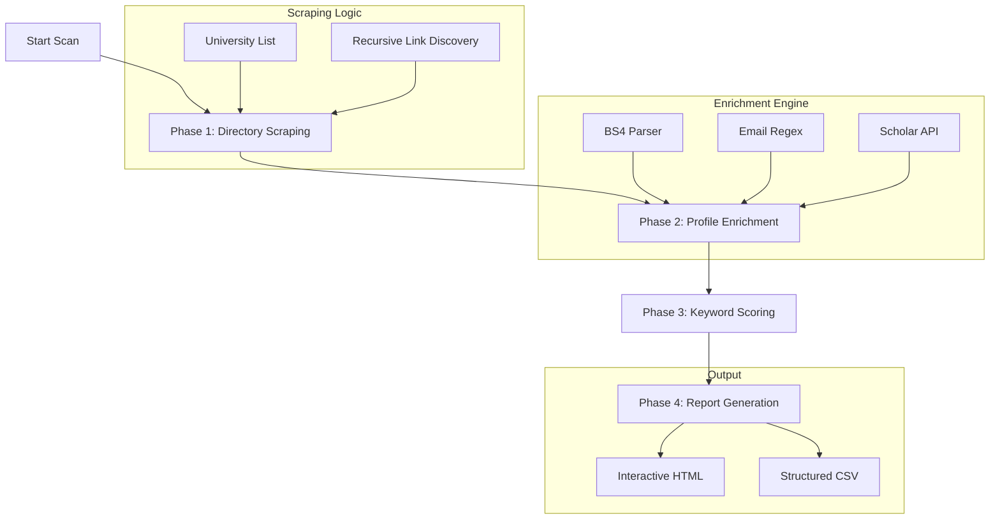

# 🎓 AdvisorScout

**The Intelligent PhD Advisor & Faculty Discovery Pipeline**

[](https://www.python.org/downloads/)
[](https://opensource.org/licenses/MIT)

AdvisorScout is a powerful, automated tool designed to help prospective PhD students and researchers find the perfect academic mentor. It bypasses the limitations of manual searching by scraping high-quality faculty directories across hundreds of universities, enriching profiles with research data, and ranking them using a custom keyword-matching engine.

---

## 🌟 Why AdvisorScout?

Finding a PhD advisor is often the most time-consuming part of the application process. Manually checking hundreds of faculty pages is tedious and prone to missing hidden gems. AdvisorScout automates this by:
- **Filtering Noise**: Only shows professors matching your specific research interests.
- **Deep Enrichment**: Pulls data from personal bios and Google Scholar that search engines often miss.
- **Interactive Dashboard**: Provides a centralized place to track your leads and contact them.

---

## 🚀 Key Features

- **🌐 Global Reach**: Pre-configured scrapers for hundreds of US and Australian universities (QS 300-800 focus).
- **🔍 Intelligent Data Extraction**:
  - **Emails**: Scrapes both direct `mailto` links and obfuscated text emails.
  - **Bios**: Uses NLP-lite techniques to identify research statements and biographies.
  - **Scholar Integration**: Finds Google Scholar profiles to pull citation metrics and h-index.
- **🎯 Advanced Matching**:
  - Multi-category keyword support.
  - Weighted scoring based on keyword frequency and relevance.
- **📊 Interactive UI**: A sleek, dark-themed dashboard with real-time filtering, search, and progress tracking.
- **⚙️ Dynamic Configuration**: Edit your search terms directly from the web UI.

---

## 🏗️ How It Works



---

## 🛠️ Installation

### 1. Requirements
- Python 3.8 or higher
- Chrome/Edge Browser (for general web access)

### 2. Setup
```bash
# Clone the repository
git clone https://github.com/your-username/AdvisorScout.git
cd AdvisorScout

# Install dependencies
pip install -r requirements.txt
```

---

## 📖 Usage

### 1. Launch the Web UI
The easiest way to use AdvisorScout is through its built-in server:
```bash
python app.py
```
Open `http://localhost:8000` in your browser.

### 2. Configure Keywords
Click the **"Configure Keywords"** button in the dashboard to set your research focus (e.g., "AI", "MEMS", "Neural Interfaces").

### 3. Start the Engine
Click **"Start New Scan"**. The tool will begin its multi-phase process. You can watch the live progress bar in the sidebar.

---

## ⚙️ Advanced Configuration

You can fine-tune `config.py` for deeper control:
- `MIN_MATCH_SCORE`: Set the relevance threshold (default: 1.0).
- `REQUEST_DELAY`: Delay between requests (default: 0.1s) to avoid being blocked.
- `MAX_PUBLICATIONS`: Number of recent papers to pull for each professor.

---

## 🗺️ Roadmap

- [ ] **AI-Powered Summarization**: Use LLMs to summarize professor research into 1-sentence "match reasons".
- [ ] **Auto-Emailer**: Integration with Gmail/Outlook to send personalized inquiry emails.
- [ ] **Expanded Geography**: Adding European and Asian university scrapers.
- [ ] **Scholarship Tracker**: Link matching professors to available funding opportunities.

---

## 📜 License

This project is licensed under the MIT License - see the [LICENSE](LICENSE) file for details.

---

*“Finding the right advisor is 50% of the PhD journey. AdvisorScout does the heavy lifting for you.”*
